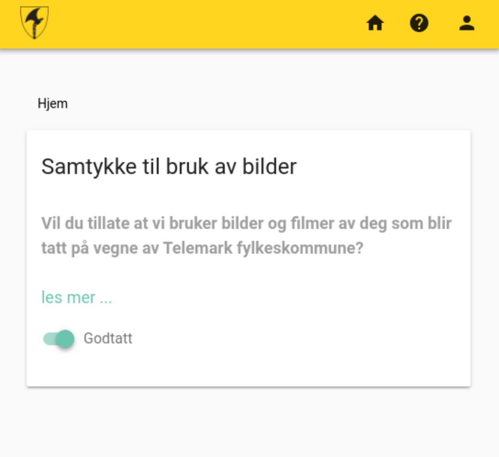

# web-vgo-minelev-portal

## Azure authentication setup

Sign in to the [Azure portal](https://portal.azure.com/)

In the left-hand navigation pane go to *Azure Active Directory* -> *App registrations* -> *New application registration* and register the app with following settings

| Setting | value |
| ------- | ----- |
| Name    | Your app name |
| Application type | Web app / API |
| Sign-on URL | https://your-domain.com/ - for testing use http://localhost:8080 |

Save the `client-id` from app registration.

## Deploy to [Now](https://zeit.co/now)

### Set secrets

```sh
now secrets add moa_tenant_id <your-tenant-id>.onmicrosoft.com
now secrets add minelev-portal-client-id <your-client-id>
```

Change `STUDENTS_API_URL`, `VUE_APP_REDIRECT_URL` and `alias` in [now.json](now.json)

Deploy to now
```sh
now && now alias
```

## Development

Change the config by creating a `.env` file or set it directly in [config.js](config.js)

``` bash
# Clone repo
git clone https://github.com/vtfk/web-vgo-minelev-portal

# install dependencies
npm install

# serve with hot reload at localhost:8080
npm run serve
```

## Theme config

Theme colors can be changed by setting following envs to preferred hex value

`COLOR_PRIMARY, COLOR_SECONDARY, COLOR_ACCENT, COLOR_ERROR, COLOR_INFO,
COLOR_SUCCESS, COLOR_WARNING`

Logo and images can be changed in [public/img/icons](public/img/icons)

## Screenshot



# License

[MIT](LICENSE)
